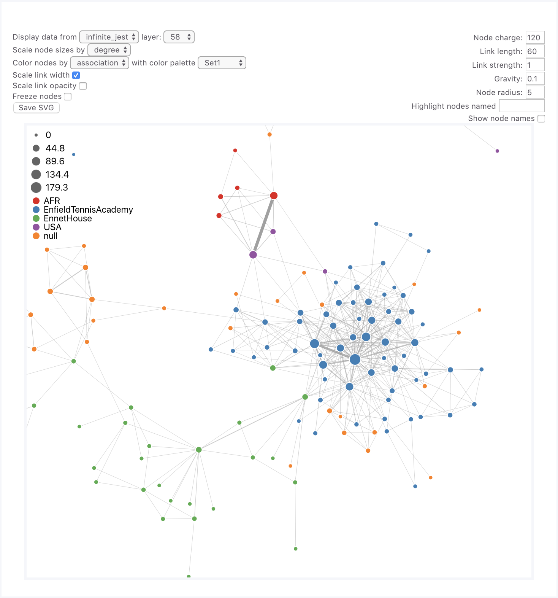

# webweb

**webweb** is a tool for creating, displaying, and sharing interactive network visualizations on the web, designed for simplicity and ease of use. It's made for users of Python, NetworkX, and MATLAB. (If you're an R user, and want to write an interface for R, get in touch!)

Head to the [webweb documentation page](https://webwebpage.github.io) for complete instructions, examples, and documentation!

[//]: # (

## Installing

python and networkx: 
`pip install webweb`

matlab: 
`git clone https://github.com/dblarremore/webweb`

## The simplest example
python: 
```python
from webweb import Web

# make a list of unweighted edges
edge_list = [[1, 2], [2, 3], [3, 4]]

# instantiate webweb and show the result
Web(edge_list).show()
```

matlab:
```matlab
% make a list of unweighted edges
edge_list = [...
    1, 2;
    2, 3;
    3, 4;
    ];
webweb(edge_list);
```

## How to use webweb

See the [examples](https://webwebpage.github.io/examples/) on the documentation site!

## Feedback and bugs

If you find a bug, create an issue! We want webweb to be as great as possible. 

If you want to implement an interface for webweb in another language, go ahead! We'll happily help.

If you repurpose or hack this code to do something else, we'd love to hear about it! 

If you use webweb to make figures for an academic paper, no citation is needed, but if you let us know and we'll will post a link to your publication [here](https://webwebpage.github.io/in-the-wild/)

## License

GNU General Public License v3+
