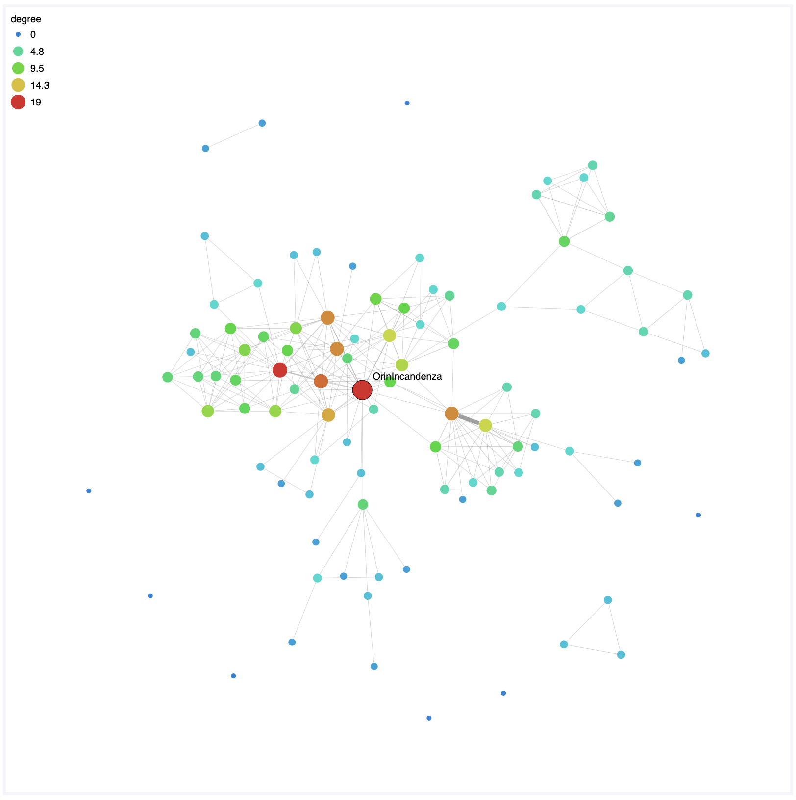

# Summary

``webweb`` is a package for creating interactive and portable visualizations of complex networks in the web browser that can be easily shared. With ``webweb``, users of MATLAB, pure Python, and Python's networkX [@networkx] are able to write complex network data directly to a dependency-free html file. When opened in a browser, this file's embedded javascript functions render both an interactive network visualization and a lightweight user interface, allowing solo users to visualize and explore their data, or easily share their visualizations with collaborators with a single file.

The style of ``webweb``'s network visualization is called a _force-directed layout_, which renders each network node as a circle, each network link as a line, and uses simulated forces to spread nodes apart while keeping linked nodes near each other. Although numerous existing software packages [@gephi] [@cytoscape] and libraries [@netwulf] [@d3js] are capable of creating such layouts, ``webweb`` fits uniquely into this space for three reasons. First, its output is a single html file, making it viewable in any OS and browser capable of rendering html and javascript, without installation of software or libraries. Second, its visualizations are dynamic, explorable, and customizable within the web browser. Third, it can be driven entirely in Python or MATLAB, and can conveniently handle many common types of network data.

In addition to visualizing networks, ``webweb`` allows users to color or size a network's nodes by metadata attributes, including scalar, boolean, and categorical values. Networks can be weighted or unweighted, and the stroke width of the network can reflect link weights via one of the html checkboxes in the interface. While all display options can be user-adjusted in the browser via the UI, all display option defaults can also be set from the Python or MATLAB code. Extensive examples and a complete list of API-accessible display options are provided on the documentation website.

``webweb`` is intended for network scientists who may or may not programmers.  Its API is structured to support a wide range of inputs formats (edge lists, adjacency matrixes, vectorized and JSON-object style metadata), and it behaves intelligently when given ambiguous inputs. 

For scientific publications, ``webweb`` features a _Save to SVG_ button, allowing a user to save the current display as a scalable vector graphics file, a format compatible with most browsers and editable using software such as Gimp or Illustrator. Figures created this way have been used in several publications [@PhysRevE.90.012805] [@systematic_hierarchy] [@ape_parasite_origins] [@liberles_2017]. 

``webweb``'s source code can be found at [@webwebrepo], and complete documentation can be found at ``webwebpage.github.io``, including examples, complete API documentation, and uses of the complete set of parameters ``webweb`` supports.

# Acknowledgements

The authors acknowledge contributions from Michael Iuzzulino and Tzu-Chi Yen, and the feedback of Allison C. Morgan and Samuel F. Way.

# References
